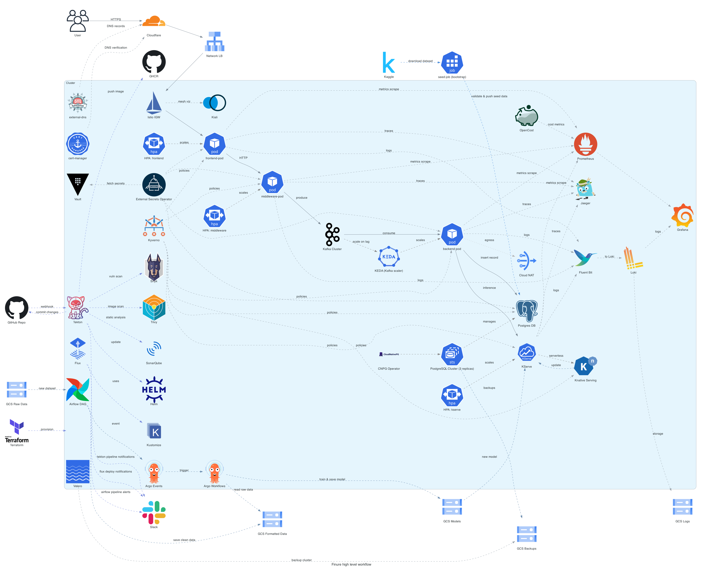

**<h1>Finure - MLOps-Driven Cloud-Native Credit Risk Detection AI Platform</h1>**

## Overview
Finure is a cloud-native application designed to streamline the credit card application process using AI and real-time risk detection. Built on Kubernetes and GCP, the application leverages a custom logistic regression model to evaluate the risk associated with each application, ensuring that only low-risk applications are approved. The platform leverages GKE, Terraform, GitOps, automated CI/CD & ML pipelines and robust infrastructure-as-code practices to deliver scalable, secure and observable microservices.

## Architecture Diagram

## Key Features
### Infrastructure & Bootstrap (Terraform, Kubernetes, GitOps)
- Automated Cluster Bootstrap: Uses Terraform and Makefile to provision entire infrastructure using a single command, which includes a private GKE cluster with a IAP tunnel to access it, on a separate VPC, Cloud NAT, GCS buckets, KMS keys, IAM roles, policies, service accounts and Workload Identity bindings to securely manage access between GCP and the Kubernetes cluster with Principle of Least Privilege (PoLP) and Flux
- GitOps with Flux: All infrastructure and app deployments are managed via Flux, syncing cluster state with the Finure Kubernetes repo
- Secure Access: Bastion host and IAP tunnel for secure cluster access; SOPS and KMS for encryption of sensitive data
- Modular & Reusable Code: Infrastructure is modularized into separate reusable Terraform modules (APIs, network, GKE, IAM, GCS, KMS etc) for easy management and scalability
- Multi Cluster & Environments: Supports multiple clusters & environments (e.g. production, staging) with environment-specific configurations
- Makefile Automation: Simplifies bootstrap, destroy and module management commands
- GitHub Actions: Automates formatting, cost checks, security validation and PR labeling for all infrastructure and app repos
- Parallel, Reliable & Governed Infra Changes: Atlantis integration for PR-based, machine-oriented Terraform executions with custom workflows
- Checkov Integration: Validates Terraform code for security and best practices
- YAML Abstraction: Reduces complexity of Terraform code using YAML for defining resources for Finure microservices

### Application Infrastructure (Helm & Kubernetes)
- Apps & Infra Deployments: Flux resources for deploying infra components such as Airflow, Argo Events, Argo Workflows, Atlantis, Kafka, Kserve, Knative, KEDA, Istio, PostgreSQL, SonarQube, Velero, Tekton and more and applications such as app-frontend, app-backend, app-gateway, app-seedjob
- Observability Stack: Prometheus, Grafana, Fluent Bit, Loki, Jaeger, Kiali, OpenTelemetry and Opencost
- Security & Policy: Hashicorp Vault, Cert-Manager, Kyverno, External-DNS, Reflector, External Secrets Operator

### CI/CD & Automation (Tekton, Atlantis, GitHub Actions)
- Tekton Pipelines: End-to-end CI/CD for all Finure repos, triggered by GitHub webhooks. Includes linting, security scans (Checkov, Snyk, SonarQube, Trivy), multi-stage multi-arch builds (Buildah), image publishing (GHCR), Helm chart updates, GitHub releases, automatic rollouts via Flux and Slack/GitHub notifications
- Atlantis Integration: PR-based, machine-oriented Terraform workflows for parallel, reliable, and governed infrastructure changes

### ML & Data Pipelines
- Airflow DAGs: Orchestrate data validation, ETL and ML pipeline triggers. Integrates with GCS for storage, Argo Events to trigger Argo Workflows, and Slack for notifications
- Argo Workflows & Events: Event-driven ML training jobs, model storage in GCS and automated workflow execution using custom logistic regression model based on scikit-learn framework
- KServe & Knative: Serverless model inference, scaling to zero and real-time predictions

### Applications (Frontend, Backend, Gateway, Seedjob)
- App Frontend: React-based web UI for credit card applications, integrated with Tailwind CSS and Vite to accept user input and submit applications to the backend via the API gateway
- App Backend: FastAPI service for processing applications, interacting with Kafka to ingest data, communicating with KServe for model predictions and storing results in PostgreSQL
- App Gateway: FastAPI-based API gateway for secure application intake and Kafka streaming
- App Seedjob: Python job to bootstrap the app with Kaggle credit approval dataset, running as a Kubernetes Job

## Repositories
The Finure project consists of several interconnected repositories, each serving a specific purpose within the overall architecture:
### 1. [Kubernetes](https://github.com/finure/kubernetes)
This repository contains the Kubernetes infrastructure for Finure project. The project uses GitOps with Flux to set up and manage the Kubernetes infrastructure and applications for the Finure platform. It includes Helm Releases, environment-specific values and other Flux/Kubernetes manifests required to deploy required infrastructure & applications with respect to the Finure project in a GKE cluster.
### 2. [Terraform](https://github.com/finure/terraform)
This repository contains the modular Terraform code to bootstrap the Kubernetes cluster and provision necessary cloud resources along with Flux using Makefile to simplify commands.
### 3. [Terraform Apps](https://github.com/finure/terraform-apps)
The main objective of this repository is to demonstrate the working a IaC model with parallel, centralized, PR-based, machine oriented automated Terraform workflows with reduced deployment conflicts and state errors, enhanced reliability & governance along with YAML abstraction layer for simplified user configurations of cloud resources. This repository contains the Terraform configuration files to set up the cloud infrastructure for Finure microservices.
### 4. [App Seedjob](https://github.com/finure/app-seedjob)
This app is part of Finure app project. It is designed to bootstrap data into a Kafka topic by downloading a public dataset from Kaggle (credit approval data) and streaming it to Kafka in batches. The application is intended to run as a Kubernetes Job within a k8s cluster, leveraging Helm charts for deployment and configuration.
### 5. [App Frontend](https://github.com/finure/app-frontend)
Finure app frontend is the web-based frontend for the Finure platform, allowing users to submit credit card applications. Built with React, Vite and Tailwind CSS, it provides a modern, responsive UI for entering application details and submitting them to the backend via the API gateway using secure CORS-enabled requests.
### 6. [App Backend](https://github.com/finure/app-backend)
This repository hosts the backend service that processes credit card applications, interacts with Kafka and communicates with KServe for model predictions, using Python and FastAPI.
### 7. [App Gateway](https://github.com/finure/app-gateway)
This repository contains the API gateway that serves as the main entry point for credit card application submissions, handling requests from the frontend and streaming data to Kafka securely.
### 8. [AI Models](https://github.com/finure/ai-models)
This repository contains the code and resources used by Kserve for training and deploying the custom logistic regression model based on scikit-learn framework used for real-time risk detection in credit card applications.
### 9. [Airflow](https://github.com/finure/airflow)
This repository contains the DAGs and configurations for orchestrating data workflows within the Finure platform using Apache Airflow.

[TODO]:
- Frankly, a lot more to go!
- Integrate external economic data into ML pipeline to improve model accuracy & proactive risk flagging
- Obserability revamp
- Add custom alerts for applications flagged as high risk after batch predictions
